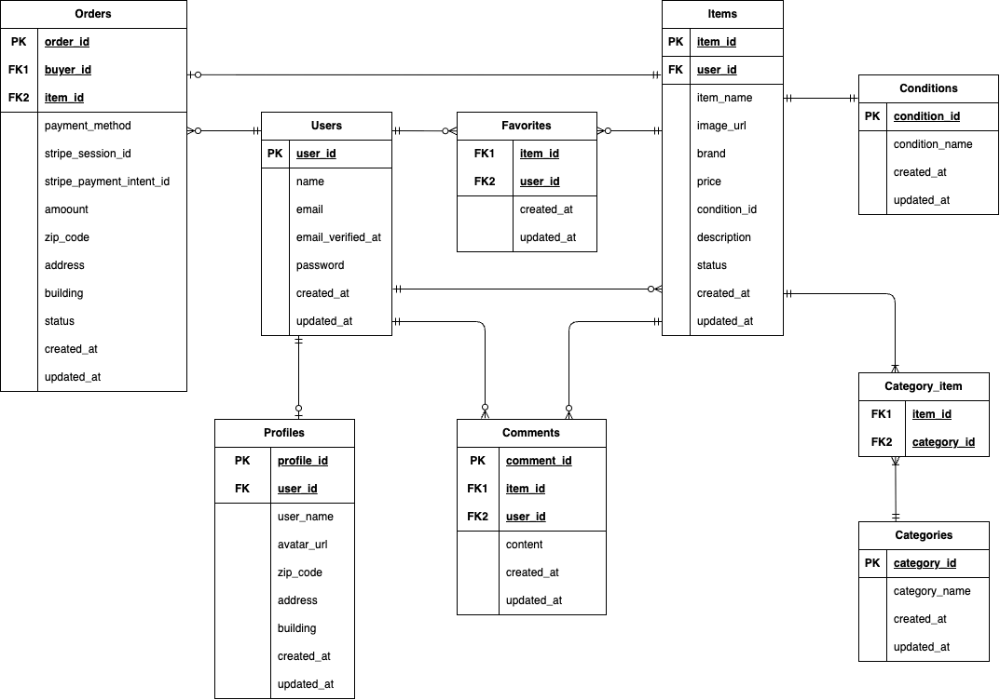

# Flea Market App

Laravelで作成したフリマアプリです。
ユーザー登録・ログイン機能・メール認証機能を備え、商品出品・購入ができるシンプルなマーケットプレイスを想定しています。

---

## 概要

- ユーザーは商品一覧と商品詳細画面を見ることができ、一覧画面では検索をかけることができます
- 会員はプロフィールの登録やコメントの登録,お気に入りの登録ができます
- 会員はマイページで出品した商品と購入した商品を確認できます
- 会員は商品を出品できます
- 会員は商品一覧から商品を購入できます
- 購入済みの商品は再購入できない仕様です

---

## 使用技術

- PHP: 8.4.17
- Laravel: 12.49.0
- DB: MySQL
- MySQL: 8.0
- nginx: 1.28.1
- View: Blade
- Docker / Docker Compose
- stripe version 1.35.0
- Livewire:

---

## 主な機能

- ユーザー登録 / ログイン / メール認証
- プロフィール登録
- 画像アップロード機能
- 商品一覧表示 / 商品詳細表示
- 商品出品
- 商品購入（決済:stripe）
- 商品名の部分一致検索

---

## ER図

### テーブル設計（抜粋）

- users
- items
- categories
- orders
- profiles

---

### リレーション

- categories (1) ─── (N) contacts



---

## 環境構築

### 1. リポジトリをクローン

```bash
git clone
cd flea-market-app
```

### 2. Dockerビルド

```bash
docker compose up -d --build
```

### 3. Laravel環境構築

#### 1. PHPコンテナに入る

```bash
docker compose exec php bash
```

#### 2. Laravelパッケージのインストール

```bash
composer install
```

#### 3. .env作成

```bash
cp .env.example .env
php artisan key:generate
```

.envを以下のように設定してください

```bash
DB_CONNECTION=mysql
DB_HOST=mysql
DB_PORT=3306
DB_DATABASE=laravel_db
DB_USERNAME=laravel_user
DB_PASSWORD=laravel_pass
```

#### 4. データベース初期化

```bash
php artisan migrate
php artisan db:seed
```

---

## テストユーザー

動作確認用のユーザーです。

### testmomoko（機能確認用ユーザー）

email: <testmomoko@example.com>
password: testmomoko

このユーザーには以下のテストデータを設定しています。

- 出品商品
- お気に入り登録
- 購入履歴

お気に入り一覧や購入履歴の確認に使用できます。

---

### testtarou

email: <testtarou@example.com>
password: testtarou

出品商品のみ設定しています。

---

## 動作確認方法

1. testmomokoでログイン
2. マイページで購入履歴を確認
3. お気に入り一覧を確認
4. 商品一覧で出品商品を確認

---

## 工夫した点

- Fortifyを用いた認証機能
- FormRequestによるバリデーションの分離
- Eloquentのリレーション・Scopeの活用
- 可読性を意識したController設計
- Livewireを用いた、支払い方法選択を即時画面に反映する非同期UIの実装

---

## 苦労した点

- データ整合性を保つテーブル設計
- タブ切り替えによる表示内容の切り替え
- stripeを利用した支払い処理

---

## 今後の改善予定

- Livewireを用いたアップロード画像の即時反映の実装
- try-catch構文を用いたエラーへの対応
- エラーページのカスタム
- Model内に記述した定数のEnumsへの移行
